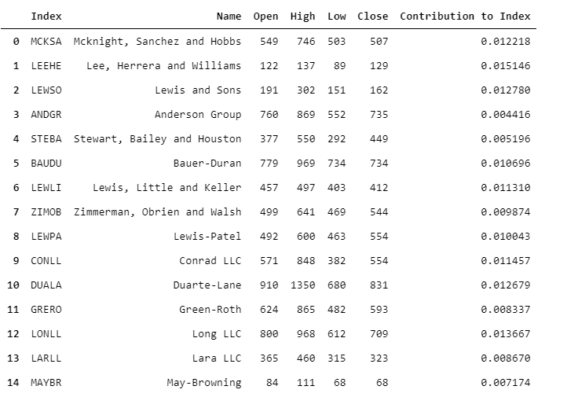
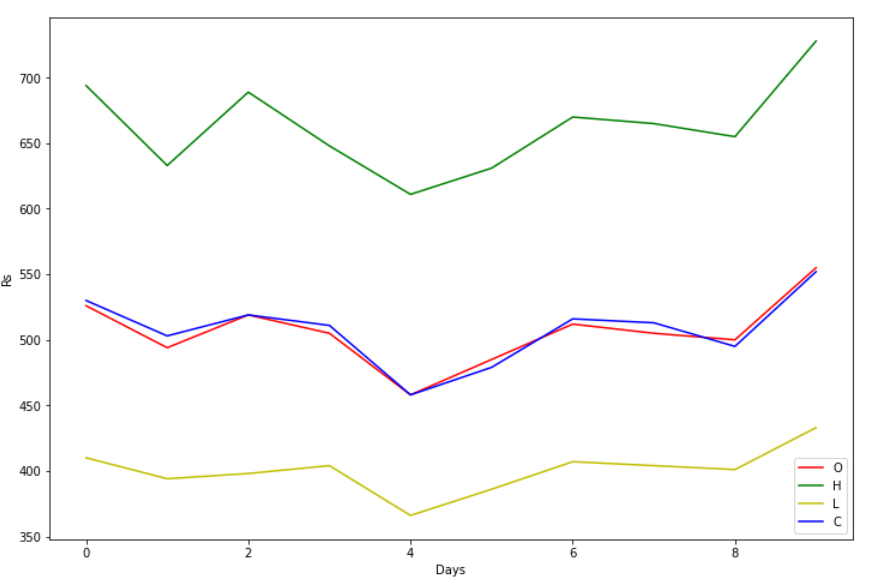

# Assignemt 10 - Tuples and Named Tuples

## Topics Covered:

* Tuples as a Data Structure

* Named Tuple

* Named Tuple - Modifying & Extending

* Named Tuple - Doc String & Default Values

## Link to Class Notebook (along with Notes)

[Class Notebook with extra Notes.](https://github.com/abdksyed/EPAi/blob/master/Session10_Tuples%20and%20Named%20Tuples/notebooks/Session10_Notes.ipynb)

# Tuples & Named Tuples

A tuple is a collection which is ordered and **immutable**.  Python supports a type of container like dictionaries called `namedtuple`present in module, `collections`. Like dictionaries they contain keys that are hashed to a particular value. But on contrary, it supports both access from key value and iteration, the functionality that dictionaries lack.

## A note on Faker

**Faker** is a Python package that generates fake data for you. Faker has the ability to print/get a lot of different fake data, for instance, it can print fake name, address, email, text, etc. We make use of fake profiles and companies for our purpose.

```python
from faker import Faker
fake = Faker() # creating faker object

fake.profile() # generates a fake profile

fake.company() # generates a fake company name
```

## Profiles using named tuples and dictionaries

We have to use Faker library to get 10000 random profiles. Using named tuple, have to calculate the most frequently appearing blood type, mean current location of all the profiles, Profile with oldest person and the age and average age calculated from all the profiles. This has to be repeated using dictionaries instead of named tuples for runtime comparison.

To store the 10000 profiles, we make use of named tuple to store each profile. Then store 10000 of these in a list. Alternatively, we could have used tuple or named tuple. But it's not efficient to use them for this purpose. Reason being, each profile data is constant and hence won't change. But when we generate each profile, we add it to the list as named tuple. With this, we just add that extra memory to the list. But is we use named tuple or tuple instead, python will keep on creating new tuples every time we add another profile. That's highly inefficient. This way, if we create and add 10000 profiles one by one, we make 10000 different tuples in the memory.


To compare the runtime of both these ways to process the profiles, we make use of a decorator, which gives us the runtime for the functions. It is as follows:

```python
def timed(n: 'Number of Iterations') -> 'Decorator':
    '''
    function acts as a decorator factory which takes function repetation count
    as argument.
    returns the decorator
    '''
    def timed_inner(fn: 'Funciton') -> 'closure':
        '''
        function acts as a decorator which runs the given function for
        specified number of times using closure.
        returns the closure
        '''
        def inner(*args, **kwargs):
            start = perf_counter()
            for _ in range(n):
                result = fn(*args, **kwargs)
            end = perf_counter()

            return result, f'Average Time to Run the Function is: {(end-start)/n :.3f}'

        return inner

    return timed_inner
```

In practical, we observe the following when we process the namedtuple profiles:

```
Named Tuple Result:  Stat(oldest_person=115, highest_blood=('AB-', 1300), mean_location=(Decimal('0.0350163466'), Decimal('0.2791915216')), average_age=57.4241)
Named Tuple Approach Average Time:  Average Time to Run the Function is: 187.309
```

and, when we repeat the same thing using dictionaries, we observe the following:

```
Dictionary Result:  {'oldest_person': 115, 'highest_blood': ('A+', 1304), 'mean_location': (Decimal('-0.3385817739'), Decimal('0.0082666902')), 'average_age': 57.2125}
Dictionary Approach Average Time:  Average Time to Run the Function is: 187.804
```

We observe that the named tuples are slightly faster. Though, this wasn't guaranteed. The dictionary approach did beat the namedtuple sometimes.

# TSE - TSAI Stock Exchange

 Welcome to TSAI Stock Exchange. Don't take it too seriously 😂, we don't have a license. The task here is to create a fake data (you can use Faker for company names) for imaginary stock exchange for top 100 companies (name, symbol, open, high, close). Assign a random weight to all the companies. Calculate and show what value stock market started at, what was the highest value during the day and where did it end. Make sure your open, high, close are not totally random.

Let's look at some of the listed stocks in our stock exchange.



Weights here define the weightage of that particular stock's value in calculation of the total valuation of the TSAIEX ( TSAI Index 😅). 

One instance of our Index is as follows for 10 Days:

TSAI_Index(open=[526, 494, 519, 505, 458, 485, 512, 505, 500, 555], high=[694, 633, 689, 648, 611, 631, 670, 665, 655, 728], low=[410, 394, 398, 404, 366, 386, 407, 404, 401, 433], close=[530, 503, 519, 511, 458, 479, 516, 513, 495, 552])

The Simulation of Index for 10 Days:



The functions to calculate the list of stocks and also, the index values can be found in the script. Here also, we make use of namedtuple to store each stock and a list to store all the namedtuples for the very same reason, described in the previous section.